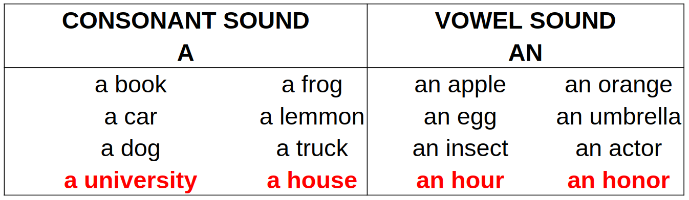

# Articles

## The Indefinite Articles - A / AN

**A** is used when the next word begins with a consonant sound (b, c, d, f, g, h, j, k etc).

* a book
* a table
* a clock
* a university (because the beginning of university sounds like YOU-niversity)

**AN** is used when the next word begins with a vowel sound (a, e, i, o, u).

* an apple
* an elephant
* an umbrella
* an hour (because the H is silent)*

#### We use A/AN with:

1. Singular nouns and the first time we refer to a person, animal or thing.

    * a child
    * an elephant
    * a television

2. We don't use A/AN with possessive pronouns, demonstratives or cardinal numbers.

    * My shirt is dirty.
    * This car is expensive.
    * One person is in the reception.

3. We use ONE (or more) instead of A/AN when the number is important.

    * There is only one exit from the airport.

## The Definite Article - THE

#### We use *THE* with:

1. A singular **or plural** noun when it is clear/obvious which person or thing we are talking about.

    * There is a lamp in my bedroom. (we mention the lamp for the first time)
    * The lamp is next to the desk.

2. Anything which we identify immediately.

    * We watched the new Avengers movie last night.

3. Musical instruments.

    * She plays the piano.

4. Something that is unique or there is only one.

    * The sun.
    * The moon.
    * The internet.

5. Names places, things, food, etc. (in capitals)

    * The Amazonas river.
    * The Dead Sea.

6. Directions (cardinal points)

    * the west.
    * the south-east.
    * the north-west.