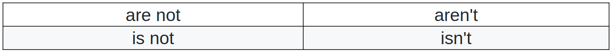

# Grammar

### Verb To Be (Present)

#### Making Questions With Verb To Be

To make a question just change the position of subject and verb.

#### Negatives Contractions

#### More Examples

Example 1:

    - John: Are you german?
    - Mary: No, I'm not.

Example 2:

    - Rose: Is he a teacher?
    - David: Yes, he is.

Example 3:

    - Andrew: Are you 21 year old?
    - Max: Yes I am.

Example 4:

    - Will: Am I your student?
    - Peter: No, you aren't.