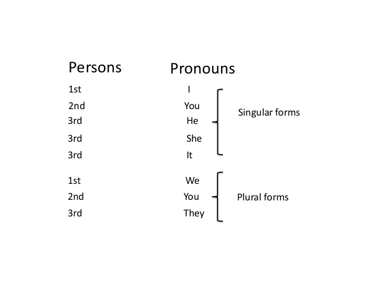

# Grammar

### Subject Pronouns

### Simple Present Tense

The simple present tense in English is used to describe an action that is regular, true or normal.

We use the Present Tense:

1. **For repeated or regular actions in the present time period.**
    * I **take** the train to the office.
    * The train to Berlin **leaves** every hour.
    * John **sleeps** eight hours every night during the week.

2. **For facts.**
    * The president of The USA **lives** in The White House.
    * A dog **has** four legs.
    * We **come** from Switzerland.

3. **For habits.**
    * I **get up** early every day.
    * Carol **brushes** her teeth twice a day.
    * They **travel** to their country house every weekend.

4. **For things that are always / usually true.**
    * It **rains** a lot in winter.
    * The Queen of England **lives** in Buckingham Palace.
    * They **speak** English at work.

#### Base from vs Infinitive Form

When the verb is not conjugated in any form we indicate that in English by using the work **TO** before the verb. For example:

* To work
* To study
* To play

If we are **only** talking about the verb, we can use its *Base Form*, for example:

* work
* study
* play

#### Conjugation and Spelling

We form the *Present Tense* simply by using the base form of the verb

Un general, in the third person we add **'S'** in the end of the verb.

| 
Subject
 | 
Verb
 | 
Rest
 of the sentence |
| ------ | ------ | ------ |
| 
I
 | 
speak
 | 
english at home
 |
| 
You
 | 
learn
 | 
english at home |
| 
We
 | 
speak
 | 
english at home
 |
| 
They
 | 
learn
 | 
english at home
 |
| 
He
 | 
speaks
 | 
english at home
 |
| 
She
 | 
learns
 | 
english at home
 |
| 
It
 | 
speaks
 | 
english at home
 |

### Verb To Be

# Useful Links

<a href="https://www.grammar.cl/Notes.htm">Grammar .CL</a>

<a href="https://www.grammar-monster.com/">Grammar Monster</a>

<a href="https://dictionary.cambridge.org/grammar/british-grammar/">Cambridge Dictionary Grammar Articles</a>