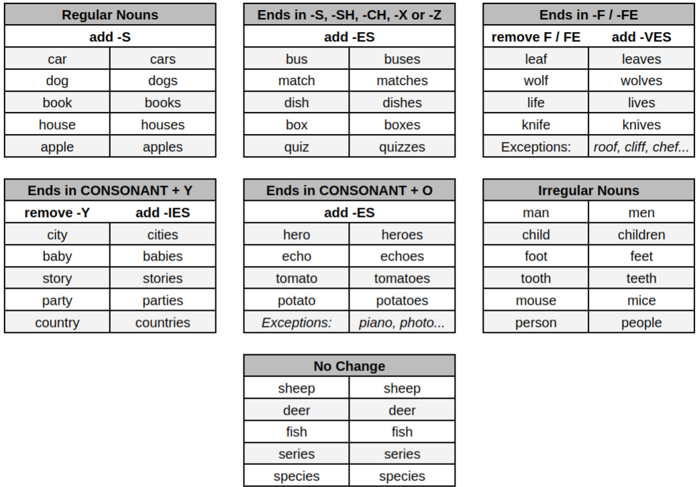

# Grammar

### Plural Nouns

In general it very simple to find the plural of a noun by adding -S to the noun. For Example:

<table>
    <tbody>
        <tr>
            <th>Singular</th>
            <th>Plural</th>
        </tr>
        <tr>
            <td>car</td>
            <td>cars</td>
        </tr>
        <tr>
            <td>house</td>
            <td>houses</td>
        </tr>
        <tr>
            <td>book</td>
            <td>books</td>
        </tr>
        <tr>
            <td>bird</td>
            <td>birds</td>
        </tr>
        <tr>
            <td>pencil</td>
            <td>pencils</td>
        </tr>
    </tbody>
</table>

1. When the noun ends in **S**, **SH**, **CH**, **X** or **Z***, we add **_ES** to the noun:

<table>
    <tbody>
        <tr>
            <th>Singular</th>
            <th>Plural</th>
        </tr>
        <tr>
            <td>kiss</td>
            <td>kisses</td>
        </tr>
        <tr>
            <td>wish</td>
            <td>wishes</td>
        </tr>
        <tr>
            <td>match</td>
            <td>matches</td>
        </tr>
        <tr>
            <td>fox</td>
            <td>foxes</td>
        </tr>
        <tr>
            <td>quiz</td>
            <td>quizzes</td>
        </tr>
    </tbody>
</table>

*Sometimes we add an extra **Z** tothe plural form of the word.

2. When the noun ends in a **CONSONANT - Y**, we remove the **Y** and add **-IES** to the noun:

<table>
    <tbody>
        <tr>
            <th>Singular</th>
            <th>Plural</th>
        </tr>
        <tr>
            <td>party</td>
            <td>parties</td>
        </tr>
        <tr>
            <td>lady</td>
            <td>ladies</td>
        </tr>
        <tr>
            <td>story</td>
            <td>stories</td>
        </tr>
        <tr>
            <td>nanny</td>
            <td>nannies</td>
        </tr>
        <tr>
            <td>city</td>
            <td>cities</td>
        </tr>
    </tbody>
</table>

3. If the noun ends in **F** or **FE**, we remove the **F / FE** and add **-VES** to the noun:

<table>
    <tbody>
        <tr>
            <th>Singular</th>
            <th>Plural</th>
        </tr>
        <tr>
            <td>life</td>
            <td>lives</td>
        </tr>
        <tr>
            <td>leaf</td>
            <td>leaves</td>
        </tr>
        <tr>
            <td>thief</td>
            <td>thieves</td>
        </tr>
        <tr>
            <td>wife</td>
            <td>wives</td>
        </tr>
    </tbody>
</table>

**EXCEPTIONS:** roof - roofs, cliff - cliffs, chief - chiefs, belief - beliefs, chef - chefs.

4. If the noun ends in **CONSONANT - O**, we usually add **-ES** to the noun:

<table>
    <tbody>
        <tr>
            <th>Singular</th>
            <th>Plural</th>
        </tr>
        <tr>
            <td>tomato</td>
            <td>tomatoes</td>
        </tr>
        <tr>
            <td>potato</td>
            <td>potatoes</td>
        </tr>
        <tr>
            <td>echo</td>
            <td>echoes</td>
        </tr>
        <tr>
            <td>hero</td>
            <td>heroes</td>
        </tr>
    </tbody>
</table>

**EXCEPTIONS:** piano - pianos, halo - halos, photo - photos.

**NOTE:** *Volcano* has two correct form of plural. Both *Volcanos* and *Volcanoes* are accepted.

5. We also have some irregular nouns, which DO NOT follow any of those rules above:

<table>
    <tbody>
        <tr>
            <th>Singular</th>
            <th>Plural</th>
        </tr>
        <tr>
            <td>man</td>
            <td>men</td>
        </tr>
        <tr>
            <td>woman</td>
            <td>women</td>
        </tr>
        <tr>
            <td>child</td>
            <td>children</td>
        </tr>
        <tr>
            <td>foot</td>
            <td>feet</td>
        </tr>
        <tr>
            <td>tooth</td>
            <td>teeth</td>
        </tr>
        <tr>
            <td>goose</td>
            <td>geese</td>
        </tr>
        <tr>
            <td>mouse</td>
            <td>mice</td>
        </tr>
    </tbody>
</table>

6. There are some nouns which remain the same both in singular and plural forms:

<table>
    <tbody>
        <tr>
            <th>Singular</th>
            <th>Plural</th>
        </tr>
        <tr>
            <td>fish</td>
            <td>fish</td>
        </tr>
        <tr>
            <td>sheep</td>
            <td>sheep</td>
        </tr>
        <tr>
            <td>deer</td>
            <td>deer</td>
        </tr>
        <tr>
            <td>moose</td>
            <td>moose</td>
        </tr>
        <tr>
            <td>aircraft</td>
            <td>aircraft</td>
        </tr>
    </tbody>
</table>

**NOTE:** Sometimes you will hear the word *fishes* (especially in songs) though it is grammatically incorrect.

## Grammar Summary

